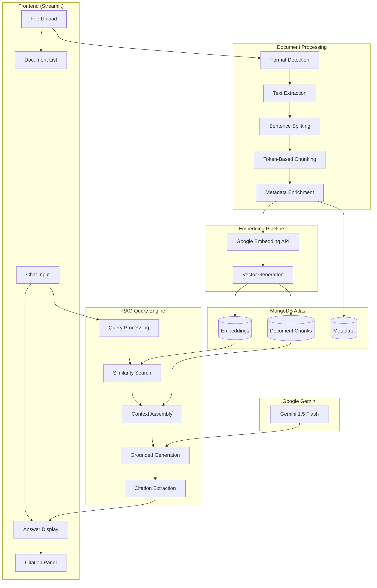
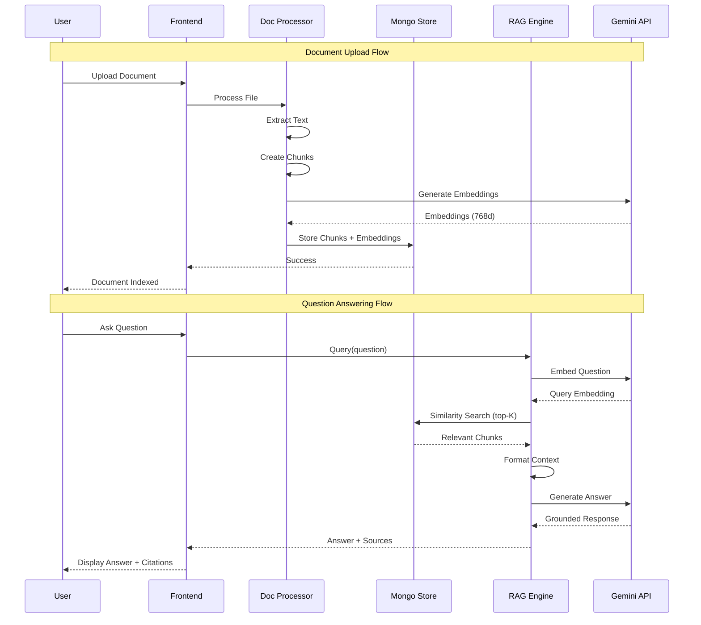

# Architecture Diagram

## System Overview

The Document Q&A Assistant uses a Retrieval-Augmented Generation (RAG) architecture to answer questions based on uploaded documents.

## Data Flow Diagram

## Component Details

### 1. Frontend (Streamlit)

| Component | Description |
|-----------|-------------|
| File Upload | Drag & drop interface for PDF, DOCX, TXT, MD files |
| Document List | Shows indexed documents with delete option |
| Chat Input | Text field for user questions |
| Answer Display | Formatted response from the assistant |
| Citation Panel | Expandable sources with document excerpts |

### 2. Document Processing

| Step | Description |
|------|-------------|
| Format Detection | Identifies file type by extension |
| Text Extraction | Uses PyPDF, python-docx, or native reading |
| Sentence Splitting | Regex-based sentence boundary detection |
| Token Chunking | 750 tokens per chunk with 100 token overlap |
| Metadata Enrichment | Adds document name, page/section info |

### 3. Embedding Pipeline

| Component | Details |
|-----------|---------|
| Model | Google Generative AI Embeddings |
| Model ID | `models/embedding-001` |
| Dimensions | 768 |
| Batch Processing | Per-chunk embedding generation |

### 4. MongoDB Storage

| Collection | Fields |
|------------|--------|
| document_chunks | content, embedding, metadata, chunk_id, token_count |

**Indexes:**
- `metadata.document_name` - For document filtering
- `vector_index` - Atlas Vector Search index on embeddings

### 5. RAG Query Engine

| Step | Description |
|------|-------------|
| Query Processing | Converts question to embedding |
| Similarity Search | Cosine similarity via Vector Search |
| Context Assembly | Formats top-K chunks with metadata |
| Grounded Generation | LLM generates answer from context only |
| Citation Extraction | Parses sources for display |

### 6. Google Gemini LLM

| Setting | Value |
|---------|-------|
| Model | `models/gemini-1.5-flash` |
| Temperature | 0.1 (factual) |
| System Prompt | Strict grounding + citation rules |

## Sequence Diagram

## Technology Stack

| Layer | Technology |
|-------|------------|
| Frontend | Streamlit |
| Backend | Python 3.9+ |
| Document Processing | PyPDF, python-docx, tiktoken |
| Vector Store | MongoDB Atlas |
| Embeddings | Google Generative AI |
| LLM | Google Gemini 1.5 Flash |
| Framework | LangChain |
